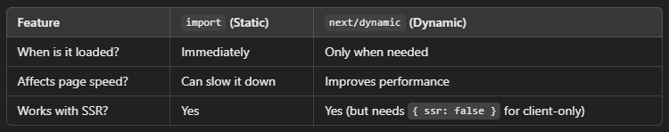

<div style="font-size: 50px; font-weight:700">
  Hydration and why it matters?
</div>

## __1. What is Hydration?__

- When we use Next.js, pages are first pre-rendered on the server. This means that the user immediately sees a fully loaded HTML page when they visit a website.

- However, this page is not interactive yet—buttons won’t work, forms can’t be filled, and dynamic content (like a cart counter or dropdowns) won’t function.

- Hydration is the process where React takes control of this pre-rendered HTML and makes it interactive.

Example:

Imagine you order a remote-controlled toy car.  
The seller sends you a perfectly assembled toy (HTML content pre-rendered by Next.js).  
But the wheels of the car don’t turn yet (no interactivity).  
Once you insert batteries (React hydration), the car becomes fully functional.
<br>
<br>

##  __2. Why is Hydration Important?__

### 1. Makes the UI Interactive  

- Without hydration, users can see the page but can’t interact with it.

- Hydration attaches event listeners so that buttons, forms, and animations work.

- Example:  
A "Like" button on a blog post looks visible when the page loads, but it won’t work until hydration happens.

### 2. Improves Performance (Faster Page Loads)

- Instead of waiting for JavaScript to download and execute before seeing anything, Next.js sends a ready-to-view page first.

- React then hydrates the page in the background, making the experience feel faster.

- Example:  
When you visit Amazon, the product details load instantly (server-side rendering), but interactive elements like the "Add to Cart" button take a fraction of a second to activate (hydration).

### 3. Helps with SEO (Search Engine Optimization)

- Google and other search engines prefer pages that load fast and have readable HTML.

- Next.js pre-renders pages before hydration, making content available for SEO.

- Example:  
A blog with an article about "Best Laptops in 2025" will rank better in Google search if its content is visible immediately rather than waiting for JavaScript to load.
<br>
<br>

## __3. How Hydration Works in Next.js?__

1. Next.js pre-renders the page on the server (Static Site Generation - SSG or Server-Side Rendering - SSR).

2.  The browser receives the HTML and displays it quickly (but without interactivity).

3.  React downloads JavaScript and "hydrates" the page, making it interactive.

```javascript
// Page.tsx (in Next.js)
export default function Page() {
  return <button onClick={() => alert('Hello!')}>Click Me</button>;
}
```

- Without Hydration: The button appears but clicking does nothing.

- After Hydration: The onClick event is attached, and clicking shows an alert.

## __4. Common Hydration Problems & How to Fix Them__

### 1. Hydration Mismatch (Client-Side Different from Server-Side)

- Happens when the HTML generated on the server differs from what React expects on the client.

- __Problem:__ The server generates 10:00:05 AM, but by the time the client loads, it’s 10:00:07 AM. React sees a difference and throws a hydration error.

- Example of Hydration Mismatch:
```javascript
export default function Page() {
    return <h1>{new Date().toLocaleTimeString()}</h1>;
}
```

- __Fix:__ Use useEffect for client-only rendering.
```javascript
import { useEffect, useState } from 'react';

export default function Page() {
  const [time, setTime] = useState('');

  useEffect(() => {
    setTime(new Date().toLocaleTimeString());
  }, []);

  return <h1>{time}</h1>;
}
```

### 2. Slow Hydration (Large JavaScript Bundles)
- If a page has too much JavaScript, hydration takes longer.

- Fix:

  - Use Dynamic Imports (next/dynamic)  
  > Dynamic Import is a feature in JavaScript and Next.js that allows you to load a module (component, function, or library) only when needed, instead of including it in the initial JavaScript bundle.
  
  > Instead of importing everything upfront, dynamic imports help reduce initial page load time and improve performance.

  - Split components into server and client parts

✔ Example of Code-Splitting with next/dynamic:
```javascript
import dynamic from 'next/dynamic';

// This component loads only when needed (not on initial load)
const HeavyComponent = dynamic(() => import('../components/HeavyComponent'), { ssr: false });

export default function Page() {
  return (
    <div>
      <h1>My Page</h1>
      <HeavyComponent />
    </div>
  );
}
```

- This improves performance because the HeavyComponent is only loaded when required.

### 3. Blocking Hydration (Unresponsive UI While Hydrating)

- If the browser is busy processing too much JavaScript, the page freezes temporarily.

- Fix: Use Suspense and Lazy Loading for progressive hydration.

- Example Using Suspense:
```javascript
import { Suspense } from 'react';
import HeavyComponent from '../components/HeavyComponent';

export default function Page() {
  return (
    <div>
      <h1>My Page</h1>
      <Suspense fallback={<p>Loading...</p>}>
        <HeavyComponent />
      </Suspense>
    </div>
  );
}
```
- This ensures the main page loads first, and the heavy component loads only when ready.

## __5. Best Practices for Hydration Optimization__

### 1. Use Server Components ("use client" Only When Necessary)

- Server components don’t hydrate, reducing JavaScript.

- Example:
```javascript
// This component runs only on the server, reducing client-side JavaScript.
export default function ServerComponent() {
  return <h1>This is a server component</h1>;
}
```

### 2. Load Interactive Components Lazily (next/dynamic)

- Avoid hydrating components that don’t need to be interactive immediately.

### 3. Minimize Client-Side State (useState, useEffect)

- Move as much logic as possible to the server.

### 4. Use Edge Functions & Streaming for Faster Hydration

- Edge rendering reduces the load on the browser, making hydration faster.

## __6. Common Questions__

### 1. What happens if hydration fails?

- If hydration fails, React throws a hydration mismatch error, meaning the server-rendered HTML doesn’t match the client-rendered version.

- Causes:  
  Using useState, useEffect, or Math.random() directly inside a component.  
  Different data on the server and client (e.g., new Date().toLocaleTimeString()).

- Fix:  
Use client-only rendering with useEffect.

### 2. Can we skip hydration for certain components?

- Yes! Next.js allows server components that don’t hydrate.

- Use "use client" only when a component needs interactivity.

- Example:
```javascript
export default function ServerComponent() {
  return <h1>This is a server component</h1>; // No hydration needed
}
```
- This reduces JavaScript bundle size and speeds up page loading.

### 3. Does hydration happen for every page in Next.js?

- Hydration happens only for pages with client-side React.

- If a page contains only static content, there’s no hydration needed.

- If a page has interactive elements (like buttons or forms), hydration happens.

### 4. Why does hydration take time?
- Hydration is slow if there’s too much JavaScript.

- Causes:  
Large JavaScript bundles  
Too many useState and useEffect hooks  
Blocking resources like big images or fonts

- Fix:  
Use dynamic imports (next/dynamic)  
Minimize client-side logic

### 5. How do I know if my page is hydrating too slowly?
- Use React DevTools or Chrome’s Performance tab.

- Check for long hydration times or large JavaScript execution.

### 6. Why should I use dynamic imports?
- Dynamic imports reduce the initial JavaScript size and improve performance.

- Load components only when needed, instead of all at once.

### 7. What is the difference between import and dynamic in Next.js?


### 8. Can I use dynamic imports for third-party libraries?
- Yes! This is very useful for large libraries like Chart.js or Moment.js.
- Example:
```javascript
const Chart = dynamic(() => import('react-chartjs-2'), { ssr: false });
```
- The chart loads only when required, reducing JavaScript size.

### 9. What happens if a dynamically imported component fails to load?
- If the network is slow or the file is missing, the component won’t load.

- __Fix:__ Always provide a fallback UI using Suspense:

```javascript
<Suspense fallback={<p>Loading...</p>}>
  <HeavyComponent />
</Suspense>
```

- This ensures users don’t see a blank screen.

### 10. Is dynamic import useful for all components?
- __No.__ Only use dynamic import for heavy or rarely used components.
- Example:  
__Good for:__ Charts, modals, maps, large images  
__Not needed for:__ Headers, footers, navigation